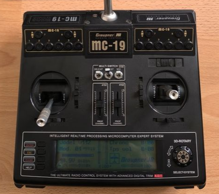
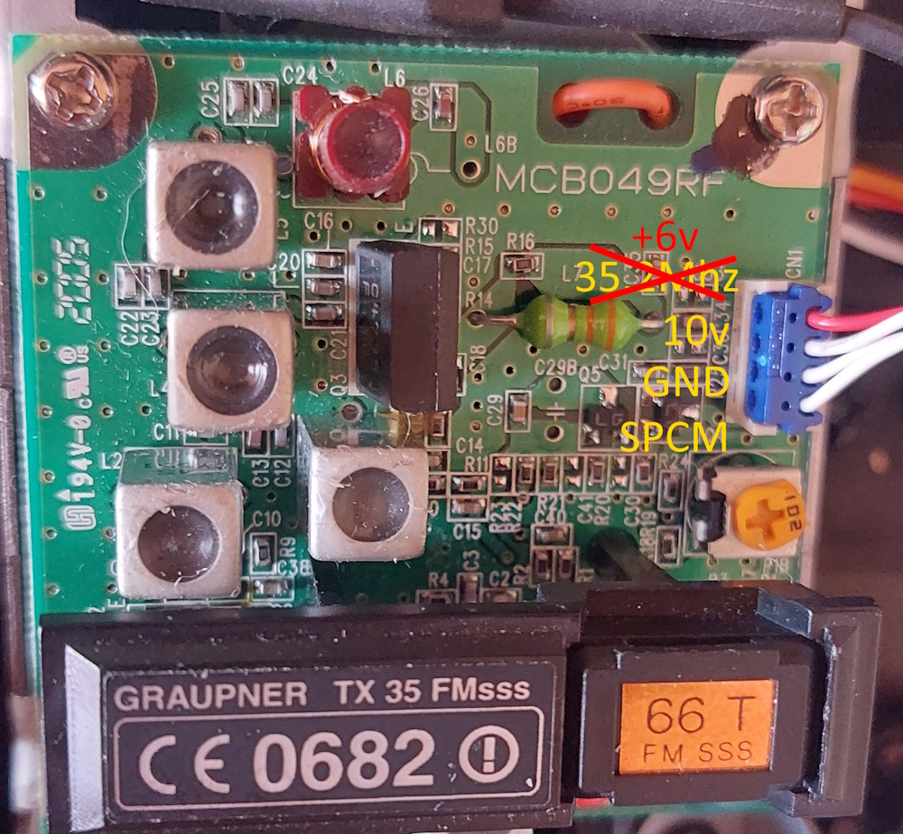
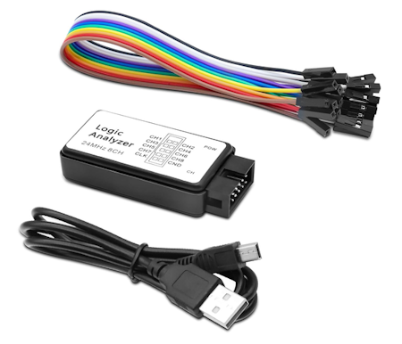

# Graupner/JR SPCM 1024 Port to ESP32

## Objective

In the OpenAVRc group, we enjoy reusing RF modules from older transmitters—such as Futaba units for PPM or PCM1024, and Multiplex units for PPM or PCM. Graupner's PCM protocol is particularly complex; although it was analyzed in detail by [**Shaul Eizikovich** and **Michel Kuenemann**](DOCS/JR_GraupnerSPCM.pdf) in 2010, the structure of the final CRC byte remained unknown.  
That is the subject of this project involving ChatGPT (GPT-5.6 Sol).  
The purpose of the ESP32_S3/Atmega2560 work was to reconstruct a **Graupner SPCM20** signal compatible with a genuine Graupner RF module and its receivers, using a fully software-generated and instrumentable implementation.  

## Resources deployed

1. Selected model
  For this project, I used a Graupner MC19 transmitter.  
  
  This transmitter is capable of generating PPM or PCM signals.  
  The PCM signal—which is far superior to the PPM signal—supports two types of failsafe modes: holding the last position or moving to a programmed position on the first eight channels.  
  The transmitter supports 12 channels in PPM mode but only 10 channels in PCM mode.  
  The MC19 transmitter consists of two parts: a main board containing the microprocessor that controls the entire unit, and an RF board operating at 35, 41, or 72 MHz.  
  The RF module was often replaceable—a common feature in radios of this type, as frequencies varied from country to country.  
  The German version I own is equipped with a 35 MHz RF module.  

  La partie HF:  
    
  
2. Analyseur logique
  Logic analyzer:
    
  
3. Regulated power supply
  Two power supply are used, one 10v and another 6v.  
   
4. A RIGOL DS1102 oscilloscope

5. A UNI-T UT61E multimeter

6. An ESP32-S3 and an Arduino ATmega2560

7. Arduino IDE 2.3.10.